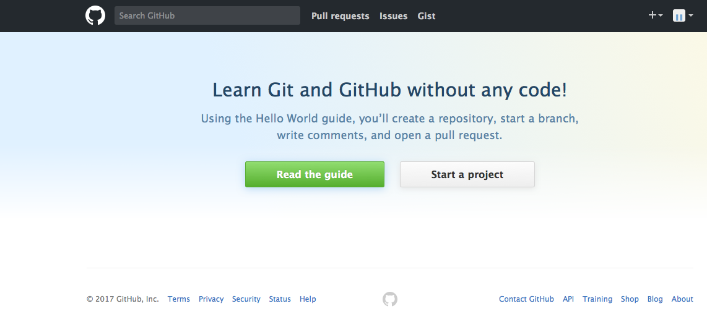
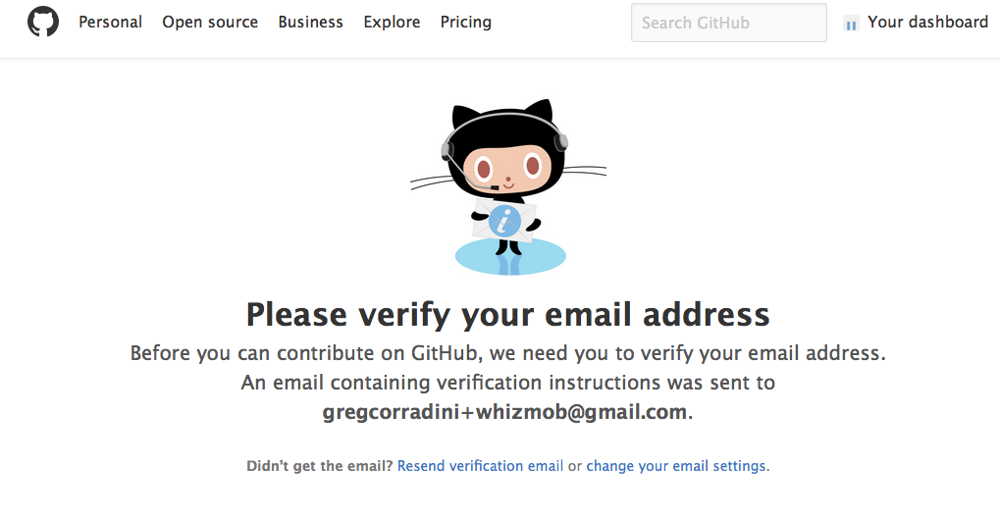
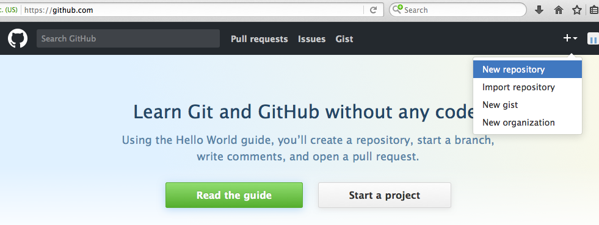
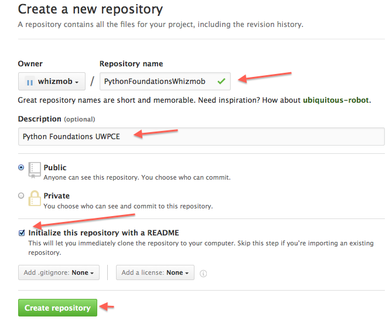
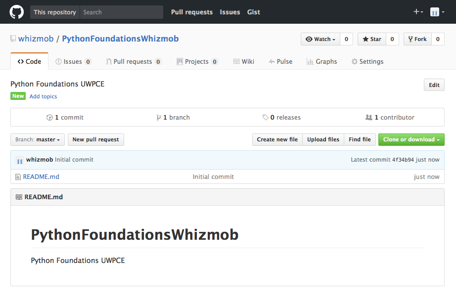
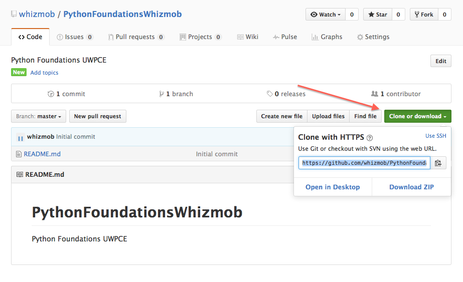
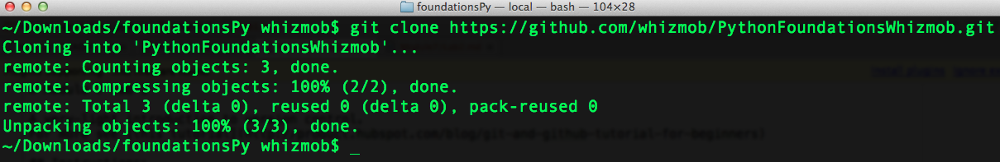
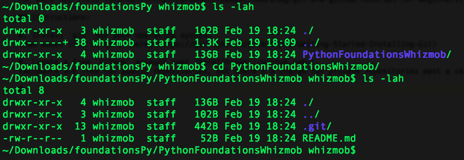
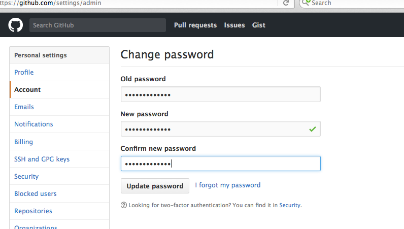

# Module 7 Lab 1

A very-light introduction to version control.
For more see [this tutorial](http://product.hubspot.com/blog/git-and-github-tutorial-for-beginners)

## Instructions:

0. Install `git` for your operating system.
Read about [how to do it here](https://git-scm.com/book/en/v2/Getting-Started-Installing-Git)

0. Create a free `GitHub` account over [here](https://github.com/).
(Accounts are free for public repositories, but there's a charge for private repositories past a certain number)

0. After you signup you'll receive an email. Hold onto that, it's important. You should see a screen like this:

0. Click the "Start Project" button to the right:

0. Go to your email and click on the verification link like this page tells us to:

0. Then go back to your `dashboard` -- link is at the top right or just go to `https://github.com`. Click on the plust ( + ) sign
at the top right and click "New Repository":

0. Fill out the new respository form with your information. When you are done click "Create Repository":

0. Welcome to your new repository dashboard view!:

0. Click the green button called "Clone Repository" and when the modal pops open copy the value there:

0. Then go to an existing workspace ( it's better if you create a new folder maybe ) and `clone` the remote repository with
this command `git clone <link you copied>`:

0. Then the magic happens and this are downloaded. Let's see what's here with some `ls` command stuff ( `dir` on Windows ):

0. Whoohoo! We've download files from the web. We can see the `README.md` from our repository. Highfive! Before we move on, go to `https://github.com/settings/admin` and create
a password and click "Update Password":

